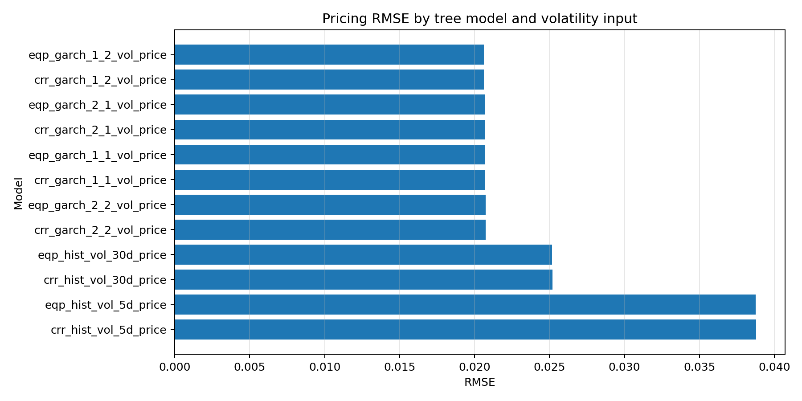
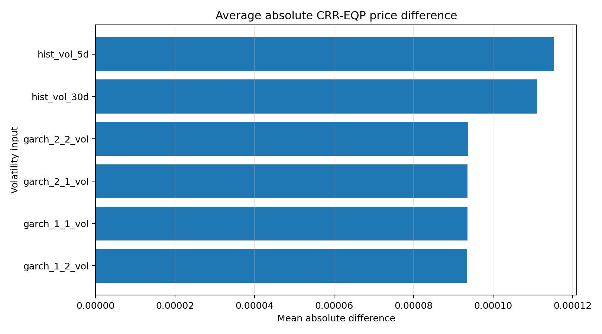
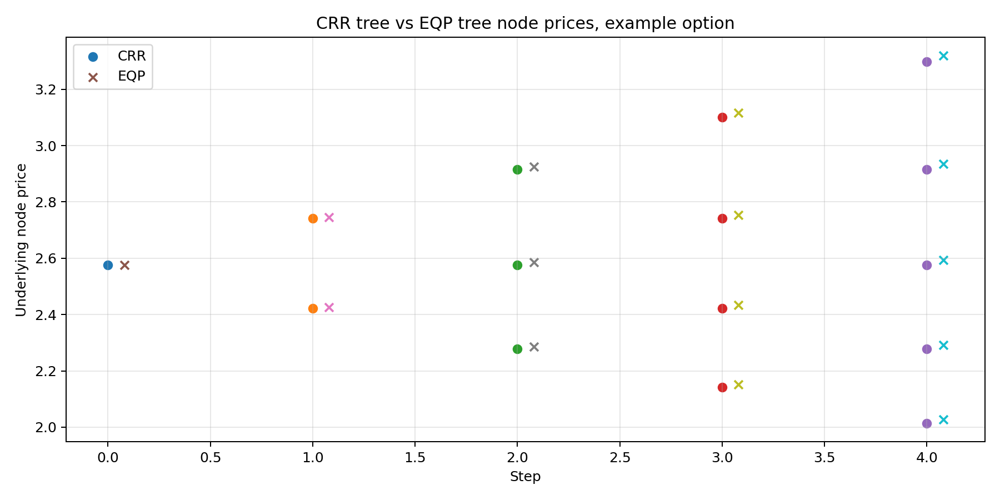
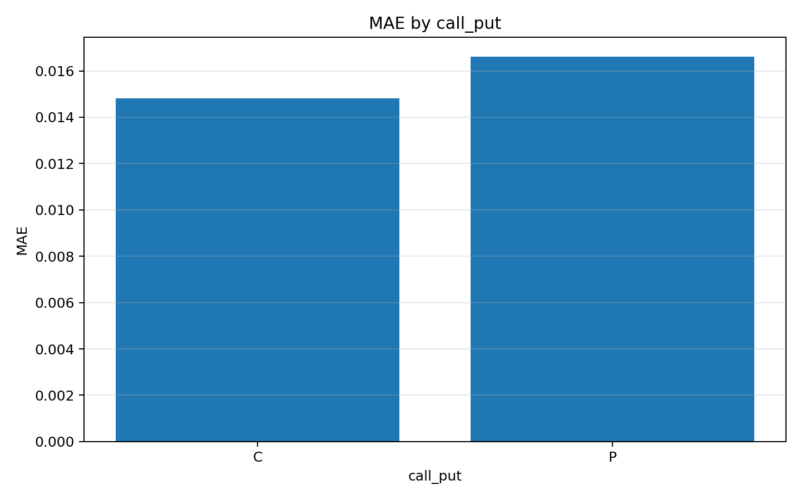
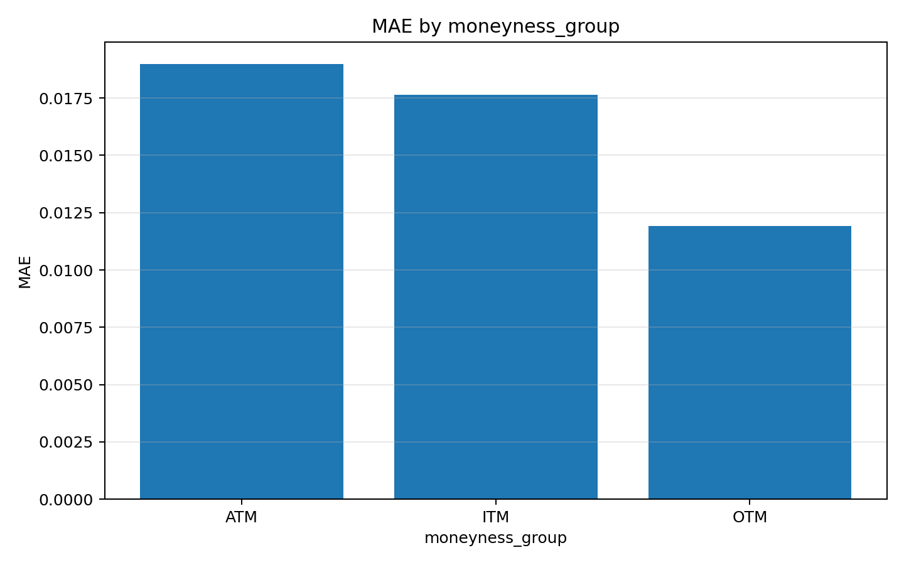
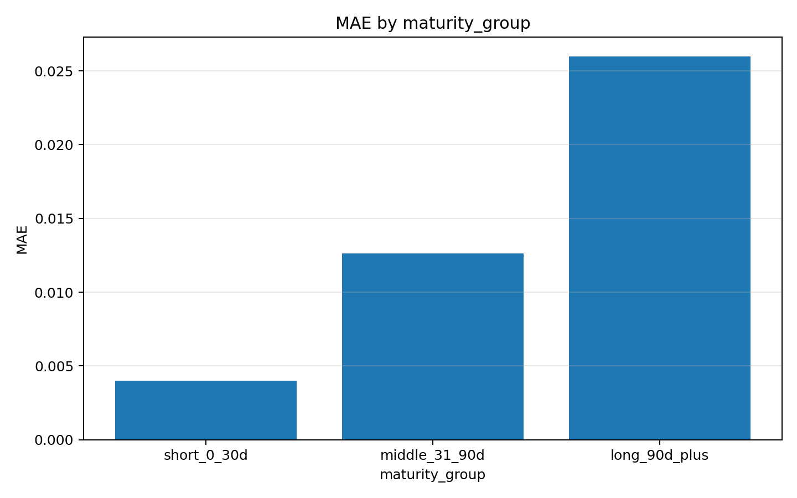
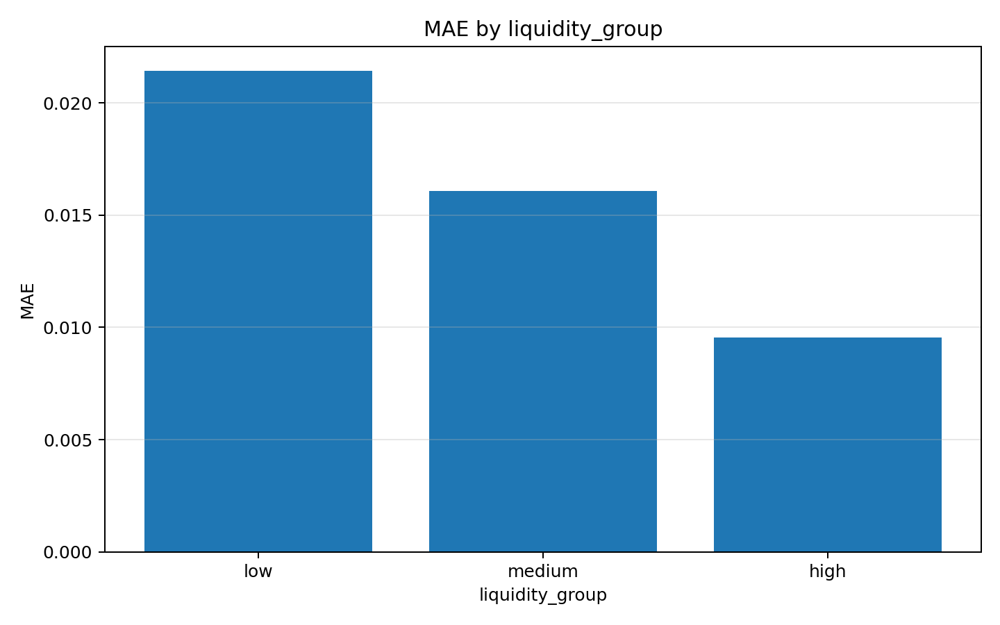

# 基于二叉树模型的上证50ETF期权定价

本项目是一个金融工程课程报告配套的 Python 实证项目，主题为：**基于二叉树模型的上证50ETF期权定价**。项目使用上证50ETF期权行情数据和标的资产 `510050.SH` 的日度价格数据，先估计标的资产波动率，再分别使用 **CRR 二叉树模型** 和 **EQP / Jarrow-Rudd 等概率二叉树模型** 计算期权理论价格，并将理论价格与市场结算价进行误差分析和可视化比较。

> 本项目已包含完整论文报告：[`reports/基于二叉树模型的上证50期权定价.md`](reports/基于二叉树模型的上证50期权定价.md)。
> 不同波动率和模型下计算的期权价格汇总在`results.csv`
---

## 1. 项目内容

本项目完成了以下工作：

1. 读取并清洗上证50ETF期权数据与 `510050.SH` 标的资产价格数据。
2. 根据标的资产日度价格计算不同波动率输入：
   - 5 日历史波动率；
   - 30 日历史波动率；
   - GARCH(1,1) 条件波动率；
   - GARCH(1,2) 条件波动率；
   - GARCH(2,1) 条件波动率；
   - GARCH(2,2) 条件波动率。
3. 将波动率数据保存到 `data/processed/510050_volatility.csv`。
4. 构建两个欧式期权二叉树定价模型：
   - CRR tree；
   - EQP / Jarrow-Rudd equal-probability tree。
5. 在不同波动率输入下计算期权理论价格。
6. 对理论价格和市场价格进行误差分析，包括：
   - Bias；
   - MAE；
   - RMSE；
   - MAPE；
   - 按认购/认沽分组；
   - 按实值、平值、虚值分组；
   - 按剩余期限分组；
   - 按流动性分组。
7. 输出实验结果表、可视化图表和 Markdown 学术报告。

---

## 2. 论文报告

课程论文位于：

```text
reports/基于二叉树模型的上证50期权定价.md
```

论文内容包括：

- CRR 树和 EQP 树的模型原理；
- 两种二叉树模型的算法流程；
- 两种树模型在数学设定上的差异；
- 二叉树期权定价模型的基本假设；
- 历史波动率估计方法；
- GARCH 模型设定；
- GARCH 参数的极大似然估计方法；
- 数据字段说明；
- 参数设定；
- 计算结果；
- 模型误差对比；
- 按流动性、期限、实值程度和期权类型分组的误差分析；
- 项目生成图表的引用与解释。

---

## 3. 项目结构

```text
50ETF_binomial_project/
├── data/
│   ├── raw/
│   │   ├── 50ETF_option_full_with_rf.csv
│   │   └── 510050_daily.csv
│   └── processed/
│       ├── 510050_volatility.csv
│       └── option_dataset_with_volatility.csv
├── outputs/
│   ├── figures/
│   │   ├── volatility_series.png
│   │   ├── rmse_by_model.png
│   │   ├── market_vs_model_baseline_crr_hist30.png
│   │   ├── crr_eqp_mean_abs_difference.png
│   │   ├── crr_vs_eqp_tree_example.png
│   │   ├── mae_by_call_put.png
│   │   ├── mae_by_moneyness_group.png
│   │   ├── mae_by_maturity_group.png
│   │   └── mae_by_liquidity_group.png
│   └── tables/
│       ├── option_pricing_results.csv
│       ├── error_summary.csv
│       ├── crr_eqp_difference_summary.csv
│       ├── garch_fit_summary.csv
│       ├── group_summary_call_put.csv
│       ├── group_summary_moneyness_group.csv
│       ├── group_summary_maturity_group.csv
│       └── group_summary_liquidity_group.csv
├── reports/
│   ├── summary_report.md
│   └── 基于二叉树模型的上证50期权定价.md
├── src/
│   ├── __init__.py
│   ├── analysis.py
│   ├── binomial.py
│   ├── config.py
│   ├── data_loader.py
│   ├── garch.py
│   ├── volatility.py
│   └── visualization.py
├── main.py
├── requirements.txt
└── README.md
```

---

## 4. 数据说明

### 4.1 期权数据

期权数据文件为：

```text
data/raw/50ETF_option_full_with_rf.csv
```

主要字段包括：

| 字段 | 含义 |
|---|---|
| `ts_code` | 期权合约代码 |
| `trade_date` | 交易日期 |
| `name` | 期权合约名称 |
| `call_put` | 认购/认沽标记 |
| `exercise_price` | 行权价 |
| `list_date` | 上市日期 |
| `delist_date` | 到期/退市日期 |
| `open`, `high`, `low`, `close` | 期权 OHLC 行情 |
| `settle` | 期权结算价，本文默认作为市场价格 |
| `vol` | 成交量 |
| `amount` | 成交金额 |
| `oi` | 持仓量 |
| `days_to_maturity` | 距到期剩余天数 |
| `rf_rate_decimal` | 无风险利率，小数形式 |

> 注意：原始期权数据中不仅包含华夏上证50ETF期权，也可能包含其他 ETF 期权。由于本项目的标的资产价格文件是 `510050.SH`，代码默认只保留 `name` 中包含 `华夏上证50ETF期权` 的合约样本，避免标的资产和期权合约不匹配。

### 4.2 标的资产数据

标的资产数据文件为：

```text
data/raw/510050_daily.csv
```

该文件包含上证50ETF，即 `510050.SH` 的日度价格数据。项目使用其收盘价计算对数收益率，并进一步估计历史波动率与 GARCH 条件波动率。

---

## 5. 模型方法

### 5.1 CRR 二叉树模型

CRR 模型将期权剩余期限 $T$ 划分为 $N$ 个时间步，每一步长度为：

$$
\Delta t = \frac{T}{N}.
$$

在每个时间步中，标的资产价格可以上涨到 $Su$，也可以下跌到 $Sd$。CRR 模型设定：

$$
u = e^{\sigma \sqrt{\Delta t}}, \qquad d = e^{-\sigma \sqrt{\Delta t}} = \frac{1}{u}.
$$

风险中性概率为：

$$
p = \frac{e^{(r-q)\Delta t} - d}{u-d}.
$$

其中，$S$ 为标的资产价格，$r$ 为无风险利率，$q$ 为连续分红率，$\sigma$ 为年化波动率。

### 5.2 EQP / Jarrow-Rudd 等概率二叉树模型

EQP 树也称为 Jarrow-Rudd tree，其核心思想是固定上涨和下跌概率相等：

$$
p = \frac{1}{2}.
$$

然后将风险中性漂移直接放入上涨和下跌因子的设定中：

$$
u = e^{(r-q-\frac{1}{2}\sigma^2)\Delta t + \sigma\sqrt{\Delta t}},
$$

$$
d = e^{(r-q-\frac{1}{2}\sigma^2)\Delta t - \sigma\sqrt{\Delta t}}.
$$

### 5.3 两种二叉树模型的差异

| 比较项 | CRR 树 | EQP / Jarrow-Rudd 树 |
|---|---|---|
| 上涨概率 | 由风险中性条件决定 | 固定为 $0.5$ |
| 下跌概率 | $1-p$ | 固定为 $0.5$ |
| 上下因子 | $u=e^{\sigma\sqrt{\Delta t}}$, $d=1/u$ | 将漂移项放入 $u,d$ 中 |
| 风险中性漂移 | 体现在概率 $p$ 中 | 体现在价格跳动因子中 |
| 直观理解 | 固定波动幅度，调整概率 | 固定概率，调整上下价格 |

对于欧式期权，两种二叉树模型在步数足够大时通常会得到接近的理论价格。

---

## 6. 波动率估计

### 6.1 历史波动率

首先根据标的资产价格计算对数收益率：

$$
r_t = \ln\frac{S_t}{S_{t-1}}.
$$

然后使用滚动窗口估计历史波动率：

$$
\sigma_{n,t} = \operatorname{std}(r_{t-n+1}, \ldots, r_t)\sqrt{252}.
$$

本项目计算：

- 5 日历史波动率：短期波动率；
- 30 日历史波动率：较长期波动率。

### 6.2 GARCH 条件波动率

GARCH 模型用于刻画金融收益率序列中的波动率聚集现象。一般的 GARCH$(p,q)$ 模型为：

$$
r_t = \mu + \varepsilon_t, \qquad \varepsilon_t = \sigma_t z_t, \qquad z_t \sim N(0,1),
$$

$$
\sigma_t^2 = \omega + \sum_{i=1}^{p}\alpha_i \varepsilon_{t-i}^2 + \sum_{j=1}^{q}\beta_j \sigma_{t-j}^2.
$$

其中，$\omega$ 为常数项，$\alpha_i$ 衡量过去冲击对当前波动率的影响，$\beta_j$ 衡量过去条件方差对当前条件方差的持续影响。

在正态分布假设下，单期条件密度为：

$$
f(r_t \mid \mathcal{F}_{t-1}) = \frac{1}{\sqrt{2\pi\sigma_t^2}} \exp\left[-\frac{(r_t-\mu)^2}{2\sigma_t^2}\right].
$$

对应的对数似然函数为：

$$
\ell(\theta) = -\frac{1}{2}\sum_t \left[\ln(2\pi) + \ln(\sigma_t^2) + \frac{(r_t-\mu)^2}{\sigma_t^2}\right].
$$

项目中通过最小化负对数似然函数来估计 GARCH 参数：

$$
\hat{\theta} = \arg\min_{\theta}[-\ell(\theta)].
$$

本项目估计了四类 GARCH 模型：

- GARCH(1,1)；
- GARCH(1,2)；
- GARCH(2,1)；
- GARCH(2,2)。

---

## 7. 快速运行

### 7.1 安装依赖

```bash
cd 50ETF_binomial_project
pip install -r requirements.txt
```

### 7.2 运行完整实验

默认二叉树步数为 50：

```bash
python main.py --steps 50
```

如果想加快运行，可以降低步数：

```bash
python main.py --steps 30
```

如果想提高精度，可以提高步数：

```bash
python main.py --steps 100
```

### 7.3 可选参数

默认使用期权结算价 `settle` 作为市场价格。如果希望使用收盘价 `close`，可以运行：

```bash
python main.py --market-price-col close
```

默认连续分红率为 0。如果希望加入分红率，例如年化 2%，可以运行：

```bash
python main.py --dividend-yield 0.02
```

---

## 8. 主要输出

### 8.1 数据输出

| 文件 | 含义 |
|---|---|
| `data/processed/510050_volatility.csv` | 标的资产收益率、历史波动率、GARCH 波动率 |
| `data/processed/option_dataset_with_volatility.csv` | 合并标的价格和波动率后的期权数据 |

### 8.2 表格输出

| 文件 | 含义 |
|---|---|
| `outputs/tables/option_pricing_results.csv` | 每个期权样本在不同模型和波动率输入下的理论价格与误差 |
| `outputs/tables/error_summary.csv` | 不同模型组合的整体误差汇总 |
| `outputs/tables/crr_eqp_difference_summary.csv` | CRR 和 EQP 的价格差异汇总 |
| `outputs/tables/garch_fit_summary.csv` | GARCH 参数估计结果 |
| `outputs/tables/group_summary_call_put.csv` | 按认购/认沽分组的误差 |
| `outputs/tables/group_summary_moneyness_group.csv` | 按实值程度分组的误差 |
| `outputs/tables/group_summary_maturity_group.csv` | 按剩余期限分组的误差 |
| `outputs/tables/group_summary_liquidity_group.csv` | 按流动性分组的误差 |

### 8.3 图表输出

| 文件 | 含义 |
|---|---|
| `outputs/figures/volatility_series.png` | 不同波动率序列对比 |
| `outputs/figures/rmse_by_model.png` | 不同模型组合 RMSE 对比 |
| `outputs/figures/market_vs_model_baseline_crr_hist30.png` | 市场价格和基准理论价格散点图 |
| `outputs/figures/crr_eqp_mean_abs_difference.png` | CRR 和 EQP 价格差异 |
| `outputs/figures/crr_vs_eqp_tree_example.png` | CRR 树和 EQP 树节点示意图 |
| `outputs/figures/mae_by_call_put.png` | 按认购/认沽分组的 MAE |
| `outputs/figures/mae_by_moneyness_group.png` | 按实值程度分组的 MAE |
| `outputs/figures/mae_by_maturity_group.png` | 按剩余期限分组的 MAE |
| `outputs/figures/mae_by_liquidity_group.png` | 按流动性分组的 MAE |

---

## 9. 实验结果摘要

本项目默认使用 `settle` 作为市场价格，二叉树步数为 50，连续分红率设为 0。整体误差结果显示，使用 GARCH 波动率的模型整体优于简单历史波动率模型。

### 9.1 不同模型组合误差对比

| 模型组合 | 样本数 | Bias | MAE | RMSE | MAPE |
|---|---:|---:|---:|---:|---:|
| EQP + GARCH(1,2) | 57,172 | -0.006675 | 0.012682 | 0.020631 | 0.270572 |
| CRR + GARCH(1,2) | 57,172 | -0.006677 | 0.012684 | 0.020633 | 0.270587 |
| EQP + GARCH(2,1) | 57,172 | -0.006628 | 0.012688 | 0.020685 | 0.270662 |
| CRR + GARCH(2,1) | 57,172 | -0.006630 | 0.012690 | 0.020688 | 0.270672 |
| EQP + GARCH(1,1) | 57,172 | -0.006642 | 0.012702 | 0.020696 | 0.270898 |
| CRR + GARCH(1,1) | 57,172 | -0.006644 | 0.012704 | 0.020699 | 0.270907 |
| EQP + GARCH(2,2) | 57,172 | -0.006588 | 0.012721 | 0.020728 | 0.271336 |
| CRR + GARCH(2,2) | 57,172 | -0.006590 | 0.012723 | 0.020730 | 0.271344 |
| EQP + 30 日历史波动率 | 54,704 | -0.005398 | 0.015708 | 0.025182 | 0.331973 |
| CRR + 30 日历史波动率 | 54,704 | -0.005398 | 0.015711 | 0.025186 | 0.331984 |
| EQP + 5 日历史波动率 | 56,728 | -0.008158 | 0.022569 | 0.038762 | 0.462427 |
| CRR + 5 日历史波动率 | 56,728 | -0.008158 | 0.022575 | 0.038777 | 0.462534 |

从 RMSE 看，表现最好的是 **EQP + GARCH(1,2)**，RMSE 为 **0.020631**。CRR 和 EQP 在相同波动率输入下的误差非常接近，说明在本项目设定的欧式期权定价场景中，二者的数值结果具有较高一致性。



### 9.2 CRR 和 EQP 的价格差异

| 波动率输入 | 样本数 | CRR-EQP 平均差异 | 平均绝对差异 | 最大绝对差异 |
|---|---:|---:|---:|---:|
| 5 日历史波动率 | 56,728 | 0.000000 | 0.000115 | 0.004436 |
| 30 日历史波动率 | 54,704 | -0.000001 | 0.000111 | 0.003945 |
| GARCH(1,1) | 57,172 | -0.000002 | 0.000094 | 0.003391 |
| GARCH(1,2) | 57,172 | -0.000002 | 0.000093 | 0.003333 |
| GARCH(2,1) | 57,172 | -0.000002 | 0.000094 | 0.003390 |
| GARCH(2,2) | 57,172 | -0.000002 | 0.000094 | 0.003376 |

CRR 和 EQP 的平均绝对差异大约在 $0.00009$ 到 $0.00012$ 之间，远小于期权价格本身的量级。因此，在 50 步二叉树下，两种模型给出的欧式期权理论价格已经非常接近。





### 9.3 基准模型分组误差分析

项目使用 `CRR + 30 日历史波动率` 作为基准模型进行分组误差分析。

#### 按认购/认沽分组

| 期权类型 | 样本数 | Bias | MAE | RMSE | MAPE |
|---|---:|---:|---:|---:|---:|
| 认购 C | 27,346 | -0.000460 | 0.014807 | 0.023881 | 0.310649 |
| 认沽 P | 27,358 | -0.010335 | 0.016616 | 0.026426 | 0.353310 |

认沽期权的 MAE 和 RMSE 高于认购期权，说明基准模型对认沽期权的定价偏差更明显。这可能与下跌保护需求、波动率偏斜和投资者风险偏好有关。



#### 按实值程度分组

| 实值程度 | 样本数 | Bias | MAE | RMSE | MAPE |
|---|---:|---:|---:|---:|---:|
| 平值 ATM | 12,122 | -0.007116 | 0.018988 | 0.027683 | 0.224860 |
| 实值 ITM | 21,294 | -0.004872 | 0.017644 | 0.028280 | 0.066137 |
| 虚值 OTM | 21,288 | -0.004947 | 0.011912 | 0.019842 | 0.658907 |

从绝对误差看，ATM 与 ITM 期权误差较高；从相对误差 MAPE 看，OTM 期权最高。这是因为虚值期权价格较低，较小的绝对误差也可能带来较大的相对误差。



#### 按剩余期限分组

| 剩余期限 | 样本数 | Bias | MAE | RMSE | MAPE |
|---|---:|---:|---:|---:|---:|
| 短期 0-30 天 | 14,338 | -0.001240 | 0.003987 | 0.008717 | 0.386792 |
| 中期 31-90 天 | 18,448 | -0.003122 | 0.012614 | 0.018953 | 0.346049 |
| 长期 90 天以上 | 21,918 | -0.010034 | 0.025988 | 0.035088 | 0.284294 |

长期期权的 MAE 和 RMSE 更高，说明期限越长，模型误差在绝对值上越大。这可能是因为长期期权包含更多未来波动率预期，而简单历史波动率难以充分刻画未来风险。



#### 按流动性分组

| 流动性分组 | 样本数 | Bias | MAE | RMSE | MAPE |
|---|---:|---:|---:|---:|---:|
| 低流动性 | 18,376 | -0.008007 | 0.021430 | 0.032302 | 0.159208 |
| 中等流动性 | 18,195 | -0.005197 | 0.016086 | 0.025388 | 0.390311 |
| 高流动性 | 18,133 | -0.002957 | 0.009540 | 0.014475 | 0.448550 |

从 MAE 和 RMSE 看，高流动性合约误差最低，低流动性合约误差最高。这说明成交活跃、持仓较多的期权价格更接近理论模型价格，而低流动性合约更容易受到买卖价差、交易不连续和价格噪声影响。



---

## 10. 主要结论

1. **GARCH 波动率优于简单历史波动率。** 以 RMSE 衡量，GARCH 类波动率输入下的模型误差整体低于 5 日和 30 日历史波动率。
2. **CRR 和 EQP 的定价结果非常接近。** 在相同波动率输入下，两种树模型的平均绝对差异仅约 $0.00009$ 到 $0.00012$。
3. **认沽期权误差大于认购期权。** 这可能与市场对下跌保护的需求、波动率偏斜和避险情绪有关。
4. **长期期权绝对误差更大。** 长期限合约对未来波动率预期更加敏感，简单历史波动率难以充分反映远期风险。
5. **低流动性合约误差更大。** 流动性越差，市场价格越容易偏离理论价值。
6. **BSM/二叉树模型更适合作为理论基准。** 现实市场存在交易成本、卖空限制、买卖价差、保证金约束和波动率非恒定等因素，因此模型价格不能被理解为完全准确的市场价格预测。

---
