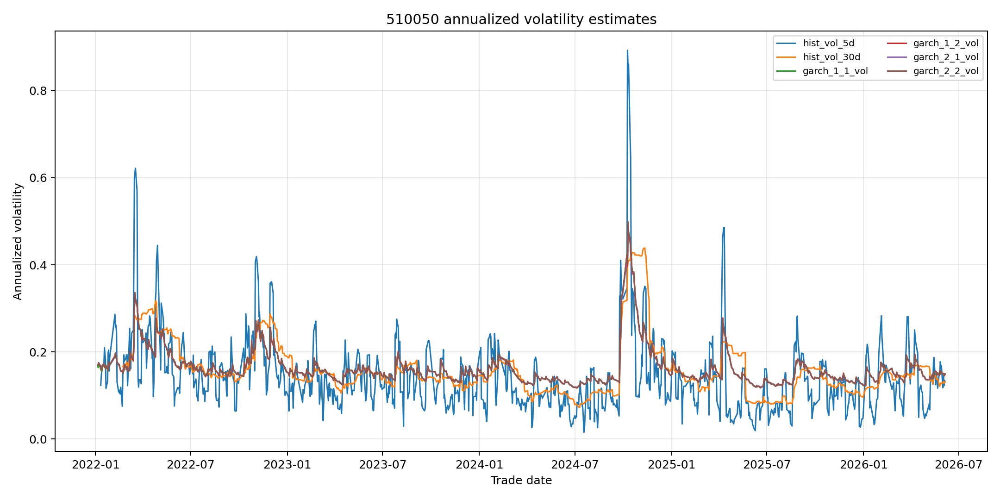
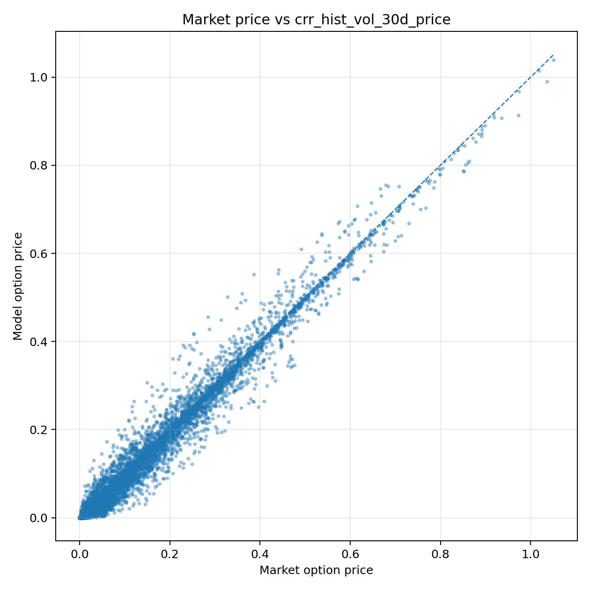

# 基于二叉树模型的上证50期权定价

## 摘要

本文基于上证50ETF期权行情数据与标的资产 510050.SH 日度价格数据，构建了一个模块化的期权定价实验项目。研究首先由标的资产价格计算 5 日、30 日历史波动率，并进一步建立 GARCH(1,1)、GARCH(1,2)、GARCH(2,1)、GARCH(2,2) 条件异方差模型估计动态波动率；随后在不同波动率输入下，分别使用 CRR 二叉树模型与 EQP/Jarrow-Rudd 等概率二叉树模型计算欧式期权理论价格；最后将理论价格与市场结算价进行比较，并从认购/认沽、实值程度、剩余期限和流动性等维度分析模型误差。实验结果显示，GARCH 类波动率输入整体优于短期和长期历史波动率输入，其中 EQP + GARCH(1,2) 在本次样本中取得最低 RMSE。CRR 与 EQP 两类树模型在 50 步设置下价格差异较小，说明在欧式期权定价场景下，二叉树模型差异主要受波动率输入影响，而非树结构本身。

**关键词：** 上证50ETF期权；二叉树模型；CRR 树；EQP 树；GARCH；历史波动率；期权定价误差

---

## 1. 引言

期权定价是金融工程课程中的核心问题。经典 Black-Scholes-Merton 模型给出了欧式期权的闭式定价公式，但现实市场中存在交易成本、流动性约束、卖空约束、波动率非恒定等因素，因此实际期权价格与理论价格之间往往存在偏差。二叉树模型是一类离散时间风险中性定价方法，既可以近似连续时间模型，又能够较直观地展示标的资产价格在不同状态下的演化路径。

本文选择上证50ETF期权作为研究对象，使用标的资产 510050.SH 的日度价格数据估计波动率，并建立 CRR 树与 EQP/Jarrow-Rudd 树两种二叉树定价模型。研究重点不是假定某一模型能够完全解释市场价格，而是通过程序化实验比较不同波动率输入和不同树结构下的理论定价表现，并分析误差来源。

---

## 2. 二叉树期权定价模型原理

### 2.1 基本假设

本文使用的二叉树模型建立在风险中性定价框架下，主要假设包括：

1. 标的资产价格在每一个离散时间步只可能上涨或下跌；
2. 市场不存在无风险套利机会；
3. 无风险利率在期权剩余期限内近似已知；
4. 标的资产波动率在单个期权定价过程中视为给定输入；
5. 本文定价对象为欧式期权，只在到期日行权；
6. 基准实验暂不考虑 ETF 分红，即连续分红率设为 $q=0$；
7. 交易成本、买卖价差、保证金和卖空限制等现实因素不直接进入模型，而在误差分析中讨论。

设当前标的资产价格为 $S_0$，行权价为 $K$，无风险利率为 $r$，连续分红率为 $q$，剩余期限为 $T$，二叉树步数为 $N$，则每一步时间长度为

$$
\Delta t = \frac{T}{N}.
$$

在风险中性测度下，欧式期权理论价值可以写成贴现后的期望收益：

$$
V_0 = e^{-rT}\mathbb{E}^{\mathbb{Q}}[\text{Payoff}(S_T)].
$$

对于认购期权，终端收益为

$$
\text{Payoff}_C(S_T)=\max(S_T-K,0),
$$

对于认沽期权，终端收益为

$$
\text{Payoff}_P(S_T)=\max(K-S_T,0).
$$

### 2.2 CRR 二叉树模型

CRR 模型由 Cox-Ross-Rubinstein 提出，其核心思想是令上涨因子和下跌因子在对数空间中关于当前价格对称，即

$$
u = e^{\sigma\sqrt{\Delta t}}, \qquad d = e^{-\sigma\sqrt{\Delta t}} = \frac{1}{u}.
$$

其中 $\sigma$ 为年化波动率。为了满足风险中性条件，风险中性概率 $p$ 由下式确定：

$$
p = \frac{e^{(r-q)\Delta t}-d}{u-d}.
$$

第 $i$ 步、第 $j$ 次上涨后的标的资产价格为

$$
S_{i,j}=S_0u^j d^{i-j}, \qquad j=0,1,\ldots,i.
$$

欧式期权可以通过终端收益向前递推定价：

$$
V_{i,j}=e^{-r\Delta t}\left[pV_{i+1,j+1}+(1-p)V_{i+1,j}\right].
$$

在本项目代码中，为提高大规模样本计算效率，并没有显式构造每一个期权的完整树形矩阵，而是利用二项分布表示终端状态概率，计算结果与欧式期权的向后递推等价。

### 2.3 EQP/Jarrow-Rudd 等概率二叉树模型

EQP 树又称等概率二叉树，在本项目中采用 Jarrow-Rudd 形式。它与 CRR 的主要区别是：CRR 固定上下跳幅的对称关系，再通过风险中性概率 $p$ 调整期望；EQP 则直接固定

$$
p=\frac{1}{2},
$$

并将风险中性漂移写入上涨和下跌因子中：

$$
u = \exp\left[(r-q-\frac{1}{2}\sigma^2)\Delta t + \sigma\sqrt{\Delta t}\right],
$$

$$
d = \exp\left[(r-q-\frac{1}{2}\sigma^2)\Delta t - \sigma\sqrt{\Delta t}\right].
$$

此时每一步上涨和下跌的概率相同，但上涨、下跌幅度本身包含了风险中性漂移项。

### 2.4 CRR 树与 EQP 树的数学差异

两种树模型都试图在离散时间下逼近标的资产的对数正态运动，但参数分配方式不同。

| 比较维度 | CRR 树 | EQP/Jarrow-Rudd 树 |
|---|---|---|
| 上涨概率 | 由风险中性条件决定 | 固定为 $0.5$ |
| 上涨/下跌因子 | $u=e^{\sigma\sqrt{\Delta t}}, d=1/u$ | $u,d$ 中包含漂移项 |
| 风险中性漂移 | 主要通过 $p$ 调整 | 主要通过 $u,d$ 调整 |
| 树结构直观性 | 上下比例对称 | 上下概率对称 |
| 欧式期权收敛性 | 步数增大时接近连续时间结果 | 步数增大时也可逼近连续时间结果 |

图 1 展示了相同输入参数下，CRR 树与 EQP 树在前 4 步中的资产价格节点差异。可以看到，两者节点分布非常接近，但由于漂移处理方式不同，节点位置并不完全一致。

---

## 3. 波动率估计方法

二叉树模型虽然没有像 BSM 模型那样直接使用闭式公式，但仍然必须输入波动率。波动率决定上涨因子、下跌因子以及风险中性概率，因此是期权定价中最重要的输入变量之一。本文分别采用历史波动率和 GARCH 条件波动率。

### 3.1 对数收益率

设 $S_t$ 为 510050.SH 在第 $t$ 个交易日的收盘价，则日对数收益率定义为

$$
r_t = \ln\left(\frac{S_t}{S_{t-1}}\right).
$$

对数收益率具有时间可加性，且在金融资产波动率估计中较为常用。

### 3.2 历史波动率

给定滚动窗口长度 $m$，本文用最近 $m$ 个交易日收益率的样本标准差估计日波动率，并乘以 $\sqrt{252}$ 年化：

$$
\hat{\sigma}_{t,m}=\operatorname{Std}(r_{t-m+1},\ldots,r_t)\sqrt{252}.
$$

本文设置两个窗口：

| 波动率 | 窗口长度 | 含义 |
|---|---:|---|
| 5 日历史波动率 | 5 个交易日 | 代表短期市场波动状态 |
| 30 日历史波动率 | 30 个交易日 | 代表相对稳定的中期波动状态 |

5 日窗口更敏感，能够迅速反映近期价格变化，但也容易受短期噪声影响；30 日窗口更加平滑，但对市场状态变化的反应较慢。

### 3.3 GARCH 模型设定

历史波动率使用固定窗口，无法直接刻画金融收益率中的波动率聚集现象。GARCH 模型通过条件方差方程刻画波动率随时间变化的特征。本文采用 Gaussian GARCH$(p,q)$ 模型，设收益率序列去均值后的扰动为

$$
\varepsilon_t = r_t - \mu,
$$

并假设

$$
\varepsilon_t = \sqrt{h_t}z_t, \qquad z_t \sim N(0,1),
$$

其中 $h_t$ 为条件方差。GARCH$(p,q)$ 的条件方差方程为

$$
h_t = \omega + \sum_{i=1}^{p}\alpha_i\varepsilon_{t-i}^2 + \sum_{j=1}^{q}\beta_j h_{t-j}.
$$

其中：

| 参数 | 含义 |
|---|---|
| $\omega$ | 长期基础方差水平 |
| $\alpha_i$ | ARCH 项系数，衡量过去收益冲击对当前波动率的影响 |
| $\beta_j$ | GARCH 项系数，衡量过去条件方差对当前波动率的持续影响 |
| $\sum \alpha_i+\sum\beta_j$ | 波动率持续性，越接近 1 表示波动冲击衰减越慢 |

为了保证条件方差为正并具有较好的经济含义，参数通常需要满足：

$$
\omega>0,\quad \alpha_i\ge 0,\quad \beta_j\ge 0,
$$

并通常要求

$$
\sum_{i=1}^{p}\alpha_i+\sum_{j=1}^{q}\beta_j<1.
$$

### 3.4 GARCH 参数的极大似然估计

在正态分布假设下，给定信息集 $\mathcal{F}_{t-1}$，有

$$
\varepsilon_t|\mathcal{F}_{t-1}\sim N(0,h_t).
$$

因此单期条件密度为

$$
f(\varepsilon_t|\mathcal{F}_{t-1})=\frac{1}{\sqrt{2\pi h_t}}\exp\left(-\frac{\varepsilon_t^2}{2h_t}\right).
$$

对样本 $t=1,\ldots,T$，对数似然函数为

$$
\ell(\theta)=\sum_{t=1}^{T}\left[-\frac{1}{2}\ln(2\pi)-\frac{1}{2}\ln h_t-\frac{\varepsilon_t^2}{2h_t}\right],
$$

其中 $\theta=(\omega,\alpha_1,\ldots,\alpha_p,\beta_1,\ldots,\beta_q)$。由于常数项 $-\frac{1}{2}\ln(2\pi)$ 不影响最优化，程序中实际最小化的负对数似然为

$$
-\ell(\theta) \propto \frac{1}{2}\sum_{t=1}^{T}\left[\ln h_t+\frac{\varepsilon_t^2}{h_t}\right].
$$

实际计算流程如下：

1. 读取 510050.SH 日收盘价并计算对数收益率；
2. 将收益率去均值，得到 $\varepsilon_t=r_t-\bar r$；
3. 为了数值稳定，将收益率乘以 100，以百分数单位进入 GARCH 估计；
4. 给定 $(p,q)$ 后，根据参数递推生成 $h_t$；
5. 计算负对数似然函数；
6. 使用 L-BFGS-B 数值优化方法，在非负参数和持续性约束下估计参数；
7. 将估计得到的条件方差从百分数单位转换回小数单位，并年化为

$$
\sigma_t = \frac{\sqrt{h_t}}{100}\sqrt{252}.
$$

本文分别估计 GARCH(1,1)、GARCH(1,2)、GARCH(2,1)、GARCH(2,2)，其参数估计结果如下。

| 模型       |    负对数似然 |    omega |   alpha1 | alpha2   |    beta1 | beta2    |
|:-----------|-------------:|---------:|---------:|:---------|---------:|:---------|
| GARCH(1,1) |      531.694 | 0.054565 | 0.064587 |          | 0.884322 |          |
| GARCH(1,2) |      530.437 | 0.062629 | 0.074571 |          | 0.708293 | 0.158428 |
| GARCH(2,1) |      530.639 | 0.054437 | 0.064527 | 0.000000 | 0.884462 |          |
| GARCH(2,2) |    530.568 | 0.069785 | 0.072858 | 0.013210 | 0.564553 | 0.284390 |

从负对数似然看，GARCH(1,2) 的拟合值最低，为 530.436716，说明它在本文样本中对收益率条件方差的拟合相对较好。同时，GARCH(2,1) 中第二个 ARCH 系数接近 0，说明在该设定下新增的第二阶冲击项贡献有限。

图 2 展示了不同波动率序列的时间变化。历史波动率在局部时间窗口内变化较明显，GARCH 波动率则更强调波动率持续性。

---

## 4. 实验设计与数据说明

### 4.1 数据来源与字段

本文使用两份 CSV 数据。

第一份为期权行情数据，原始数据共有 106,438 行、24 个字段。由于原始文件中还包含科创板50ETF期权，而本文标的资产价格文件为 510050.SH，因此实验中仅保留 `name` 字段包含“华夏上证50ETF期权”的样本。筛选后共得到 57,792 行记录，包含 2,088 个期权合约，交易日期范围为 20220104 至 20260605，其中认购期权 28,890 行，认沽期权 28,902 行。

第二份为 510050.SH 日度行情数据，共 1,069 行、8 个字段，日期范围为 20220104 至 20260605。

主要字段说明如下。

| 数据表 | 字段 | 含义 | 实验用途 |
|---|---|---|---|
| 期权表 | `ts_code` | 期权合约代码 | 识别不同合约 |
| 期权表 | `name` | 期权名称 | 筛选华夏上证50ETF期权 |
| 期权表 | `call_put` | 认购/认沽类型 | 决定终端收益函数 |
| 期权表 | `exercise_price` | 行权价 | 二叉树定价中的 $K$ |
| 期权表 | `trade_date` | 交易日期 | 与标的资产价格合并 |
| 期权表 | `settle` | 结算价 | 本文默认市场价格 |
| 期权表 | `vol` | 成交量 | 流动性分组依据 |
| 期权表 | `oi` | 持仓量 | 辅助观察市场活跃度 |
| 期权表 | `days_to_maturity` | 剩余到期天数 | 计算 $T$ |
| 期权表 | `rf_rate_decimal` | 无风险利率小数形式 | 二叉树贴现和风险中性概率 |
| ETF 表 | `close` | 510050.SH 收盘价 | 标的资产价格 $S$ 与波动率计算 |
| ETF 表 | `vol` | ETF 成交量 | 辅助行情信息 |

### 4.2 参数设定

本项目的主要参数设定如下。

| 参数 | 取值 | 说明 |
|---|---:|---|
| 年交易日数 | 252 | 用于波动率年化 |
| 年自然日数 | 365 | 用于 $T=\text{days\_to\_maturity}/365$ |
| 二叉树步数 | 50 | CRR 与 EQP 均使用 50 步 |
| 市场价格字段 | `settle` | 使用结算价衡量市场价格 |
| 连续分红率 | 0 | 基准实验暂不考虑 ETF 分红 |
| 历史波动率窗口 | 5、30 | 分别代表短期和中期历史波动率 |
| GARCH 阶数 | (1,1)、(1,2)、(2,1)、(2,2) | 比较不同条件波动率估计 |

期权剩余期限定义为

$$
T=\frac{\text{days\_to\_maturity}}{365}.
$$

市场价格定义为

$$
P_{mkt}=\text{settle}.
$$

### 4.3 实验流程

实验流程可以概括为以下步骤。

1. **数据读取与清洗。** 读取期权表和 ETF 表，将日期字段转为标准日期格式，并筛选华夏上证50ETF期权样本。
2. **波动率估计。** 使用 510050.SH 的收盘价计算对数收益率、5 日历史波动率、30 日历史波动率和四类 GARCH 条件波动率。
3. **数据合并。** 以 `trade_date` 为键，将标的资产价格和波动率合并到每一条期权记录。
4. **变量构造。** 构造剩余期限 $T$、无风险利率 $r$、实值程度 `moneyness`、期限分组和流动性分组。
5. **理论定价。** 对每一种波动率输入，分别使用 CRR 树和 EQP 树计算理论价格。
6. **误差计算。** 将理论价格与市场结算价比较，计算 Bias、MAE、RMSE、MAPE 和中位绝对误差。
7. **分组分析。** 按认购/认沽、实值/平值/虚值、剩余期限和成交量分箱进行误差分析。
8. **可视化。** 输出波动率序列、市场价格与理论价格散点图、RMSE 对比图、CRR/EQP 差异图和分组 MAE 图。

---

## 5. 实验结果

### 5.1 整体定价误差对比

本文对 6 种波动率输入与 2 种树模型进行组合，共得到 12 组理论价格结果。误差指标定义如下：

$$
\text{Error}_i = \hat P_i - P_{mkt,i},
$$

$$
\text{Bias}=\frac{1}{n}\sum_{i=1}^{n}(\hat P_i-P_{mkt,i}),
$$

$$
\text{MAE}=\frac{1}{n}\sum_{i=1}^{n}|\hat P_i-P_{mkt,i}|,
$$

$$
\text{RMSE}=\sqrt{\frac{1}{n}\sum_{i=1}^{n}(\hat P_i-P_{mkt,i})^2},
$$

$$
\text{MAPE}=\frac{1}{n}\sum_{i=1}^{n}\left|\frac{\hat P_i-P_{mkt,i}}{P_{mkt,i}}\right|.
$$

其中 $\hat P_i$ 为模型理论价格，$P_{mkt,i}$ 为市场结算价。

整体误差结果如下。

| 模型与波动率输入        |   有效样本数 |        Bias |       MAE |      RMSE |     MAPE |   中位绝对误差 |
|:------------------------|-------------:|------------:|----------:|----------:|---------:|---------------:|
| eqp_garch_1_2_vol_price |        57172 | -0.00667526 | 0.0126821 | 0.020631  | 0.270572 |     0.00673294 |
| crr_garch_1_2_vol_price |        57172 | -0.00667729 | 0.012684  | 0.0206334 | 0.270587 |     0.00672512 |
| eqp_garch_2_1_vol_price |        57172 | -0.00662755 | 0.0126876 | 0.0206852 | 0.270662 |     0.00670888 |
| crr_garch_2_1_vol_price |        57172 | -0.00662962 | 0.0126896 | 0.0206877 | 0.270672 |     0.00671371 |
| eqp_garch_1_1_vol_price |        57172 | -0.00664228 | 0.0127024 | 0.0206962 | 0.270898 |     0.00672405 |
| crr_garch_1_1_vol_price |        57172 | -0.00664431 | 0.0127044 | 0.0206987 | 0.270907 |     0.0067256  |
| eqp_garch_2_2_vol_price |        57172 | -0.00658838 | 0.0127207 | 0.0207275 | 0.271336 |     0.00672908 |
| crr_garch_2_2_vol_price |        57172 | -0.00659041 | 0.0127225 | 0.0207298 | 0.271344 |     0.00673627 |
| eqp_hist_vol_30d_price  |        54704 | -0.00539788 | 0.0157083 | 0.0251823 | 0.331973 |     0.00871272 |
| crr_hist_vol_30d_price  |        54704 | -0.00539846 | 0.0157113 | 0.025186  | 0.331984 |     0.00869926 |
| eqp_hist_vol_5d_price   |        56728 | -0.0081585  | 0.0225693 | 0.0387621 | 0.462427 |     0.0119179  |
| crr_hist_vol_5d_price   |        56728 | -0.00815839 | 0.0225748 | 0.0387772 | 0.462534 |     0.0119193  |

从 RMSE 看，表现最好的模型为 **eqp_garch_1_2_vol_price**，RMSE 为 **0.020631**，MAE 为 **0.012682**，Bias 为 **-0.006675**。第二好的模型为 **crr_garch_1_2_vol_price**，其表现与第一名几乎一致。表现最差的是 **crr_hist_vol_5d_price**，说明 5 日历史波动率输入在本样本中更容易受到短期噪声影响，定价稳定性较弱。

图 3 对所有模型组合的 RMSE 进行了可视化比较。可以看到，GARCH 类波动率输入对应的 RMSE 整体低于历史波动率输入，尤其低于 5 日历史波动率输入。

### 5.2 市场价格与模型价格散点图

图 4 展示了基准模型 `CRR + 30 日历史波动率` 的理论价格与市场结算价之间的关系。若模型定价完全准确，散点应集中在 45 度线附近。从图中可以观察到，大多数样本沿对角线分布，但仍存在明显偏离，说明二叉树理论价格能够反映期权价格的主要水平，但无法完全解释真实市场价格。

### 5.3 CRR 树与 EQP 树价格差异

CRR 与 EQP 之间的价格差异如下。

| 波动率输入    |   有效样本数 |   CRR-EQP均值 |   平均绝对差异 |   最大绝对差异 |
|:--------------|-------------:|--------------:|---------------:|---------------:|
| hist_vol_5d   |        56728 |   1.07274e-07 |    0.000115239 |     0.00443584 |
| hist_vol_30d  |        54704 |  -5.77716e-07 |    0.000110964 |     0.00394486 |
| garch_1_1_vol |        57172 |  -2.03167e-06 |    9.35363e-05 |     0.00339121 |
| garch_1_2_vol |        57172 |  -2.03133e-06 |    9.33984e-05 |     0.00333323 |
| garch_2_1_vol |        57172 |  -2.06708e-06 |    9.35407e-05 |     0.0033902  |
| garch_2_2_vol |        57172 |  -2.03021e-06 |    9.3739e-05  |     0.00337642 |

结果显示，不同波动率输入下，CRR 与 EQP 的平均绝对差异约在 0.000093 到 0.000115 之间，最大绝对差异约在 0.0033 到 0.0044 之间。相对于期权平均市场价格 0.146463，两类树模型之间的差距较小。因此，在本文 50 步的欧式期权定价实验中，模型价格差异主要来自波动率输入，而不是 CRR 与 EQP 树结构本身。

---

## 6. 分组误差分析

本节分组分析统一采用项目中的基准列 `crr_hist_vol_30d_price`，即 **CRR 树 + 30 日历史波动率**。该设置不是整体最优模型，但具有较强解释性：30 日历史波动率计算透明、容易复现，CRR 树也是课程中最常见的二叉树模型。

基准模型共有 54,704 条有效定价样本。样本平均市场价格为 0.146463，标的资产平均价格为 2.740832，30 日历史波动率均值为 0.168516，平均剩余期限为 85.23 天。

### 6.1 按认购/认沽分组

| 期权类型   |   样本数 |         Bias |       MAE |      RMSE |     MAPE |
|:-----------|---------:|-------------:|----------:|----------:|---------:|
| C          |    27346 | -0.000459698 | 0.0148065 | 0.023881  | 0.310649 |
| P          |    27358 | -0.0103351   | 0.0166156 | 0.0264261 | 0.35331  |

认沽期权的 MAE 与 RMSE 均高于认购期权，并且 Bias 更负。这说明基准模型对认沽期权存在更明显的低估。可能原因包括：市场对下跌保护的需求更强，认沽期权中包含更高的风险溢价；同时，真实市场存在波动率偏斜，认沽期权隐含波动率往往高于基于历史收益率估计得到的波动率。

### 6.2 按实值程度分组

本文使用 $S/K$ 定义实值程度。对于认购期权，$S/K>1.03$ 为实值，$S/K<0.97$ 为虚值；对于认沽期权方向相反；中间区间记为平值。

| 实值程度   |   样本数 |        Bias |       MAE |      RMSE |      MAPE |
|:-----------|---------:|------------:|----------:|----------:|----------:|
| ATM        |    12122 | -0.00711607 | 0.0189881 | 0.0276835 | 0.22486   |
| ITM        |    21294 | -0.00487208 | 0.0176439 | 0.0282795 | 0.0661371 |
| OTM        |    21288 | -0.00494693 | 0.0119121 | 0.019842  | 0.658907  |

从绝对误差看，平值期权和实值期权误差较大，而虚值期权的 MAE 相对较小。但从 MAPE 看，虚值期权的相对误差最高。这一现象符合期权定价特征：虚值期权价格本身较低，即使绝对误差不大，相对误差也会被放大。平值期权对波动率最敏感，因此当历史波动率不能准确代表市场隐含波动率时，平值期权容易产生较大绝对误差。

### 6.3 按剩余期限分组

| 期限分组      |   样本数 |        Bias |        MAE |       RMSE |     MAPE |
|:--------------|---------:|------------:|-----------:|-----------:|---------:|
| short_0_30d   |    14338 | -0.00124046 | 0.00398686 | 0.00871655 | 0.386792 |
| middle_31_90d |    18448 | -0.00312236 | 0.0126135  | 0.0189532  | 0.346049 |
| long_90d_plus |    21918 | -0.0100342  | 0.0259883  | 0.0350877  | 0.284294 |

长期期权的 MAE 和 RMSE 显著高于短期期权。原因在于剩余期限越长，期权时间价值越大，理论价格对波动率和利率等输入更加敏感；同时长期期权未来不确定性更强，使用固定历史窗口估计波动率更难准确反映市场预期。短期期权的绝对误差较低，但 MAPE 较高，说明短期期权价格较小，相对误差容易被放大。

### 6.4 按流动性分组

本文使用期权成交量 `vol` 的三分位数对样本进行流动性分组，分为 low、medium 和 high 三组。

| 流动性分组   |   样本数 |        Bias |        MAE |      RMSE |     MAPE |
|:-------------|---------:|------------:|-----------:|----------:|---------:|
| low          |    18376 | -0.00800747 | 0.02143    | 0.0323021 | 0.159208 |
| medium       |    18195 | -0.00519653 | 0.0160861  | 0.025388  | 0.390311 |
| high         |    18133 | -0.00295711 | 0.00953976 | 0.0144745 | 0.44855  |

低流动性组合的 MAE 和 RMSE 最大，高流动性组合的 MAE 和 RMSE 最小，说明成交越活跃的期权，其市场价格越接近模型理论价格。这与市场微观结构直觉一致：低流动性期权买卖价差更宽，成交价格更容易偏离理论中值；高流动性期权参与者更多，价格发现效率更高，因此绝对误差更低。需要注意的是，高流动性组的 MAPE 较高，可能是因为部分高流动性样本价格较低，相对误差对分母较敏感。

---

## 7. 结果讨论

### 7.1 波动率输入是影响二叉树定价误差的核心因素

从整体误差表可以看到，GARCH 类波动率输入明显优于 5 日和 30 日历史波动率。原因在于 GARCH 模型能够利用过去收益冲击和过去条件方差递推当前波动率，更适合描述金融时间序列中的波动率聚集。相比之下，5 日历史波动率窗口过短，容易被极端收益影响；30 日历史波动率更稳定，但仍然无法显式刻画条件异方差结构。

### 7.2 CRR 与 EQP 树结构差异相对较小

本实验中，CRR 与 EQP 在相同波动率输入下的价格非常接近。这说明对于欧式期权，当树步数达到 50 步时，两种树结构都能够较好地逼近风险中性终端分布。CRR 与 EQP 的理论差异主要体现在参数分配方式：前者用风险中性概率吸收漂移，后者固定概率并将漂移放入 $u,d$。但在足够细的时间离散下，两者最终给出的期权价格差异不大。

### 7.3 模型整体存在低估倾向

大多数模型的 Bias 为负，说明理论价格平均低于市场价格。可能原因包括：第一，市场价格中可能包含风险溢价和波动率风险溢价；第二，本文使用历史波动率和 GARCH 波动率，而真实期权市场往往按照隐含波动率定价；第三，ETF 分红、交易成本、保证金、卖空限制和买卖价差等因素并未显式进入模型；第四，认沽期权中的避险需求可能使市场价格高于简单历史波动率模型给出的理论价格。

### 7.4 流动性与期限结构对误差有明显影响

分组结果显示，低流动性期权和长期期权的绝对误差更大。低流动性导致价格发现效率下降，长期期权则积累了更大的波动率预测误差。因此，在实际定价中不能只关注模型公式本身，还应考虑样本的交易活跃度和期限结构。

---

## 8. 结论

本文基于上证50ETF期权和 510050.SH 标的资产价格数据，构建了一个完整的二叉树期权定价实验。研究使用 5 日、30 日历史波动率和四类 GARCH 条件波动率作为输入，分别通过 CRR 树与 EQP/Jarrow-Rudd 树计算期权理论价格，并与市场结算价进行误差比较。

主要结论如下：

1. 二叉树模型需要波动率输入，且波动率估计方法对定价误差影响显著；
2. GARCH 类条件波动率整体优于固定窗口历史波动率，EQP + GARCH(1,2) 在本次实验中取得最低 RMSE；
3. 在 50 步欧式二叉树设定下，CRR 与 EQP 的定价结果非常接近，树结构差异小于波动率输入差异；
4. 模型整体存在一定低估市场价格的倾向，尤其在认沽期权中更明显；
5. 长期限、低流动性和平值附近期权的定价误差更值得关注。

后续研究可以进一步引入隐含波动率、波动率曲面、ETF 分红调整、买卖价差中间价和更高频数据，以提升模型对真实市场价格的解释能力。

---

