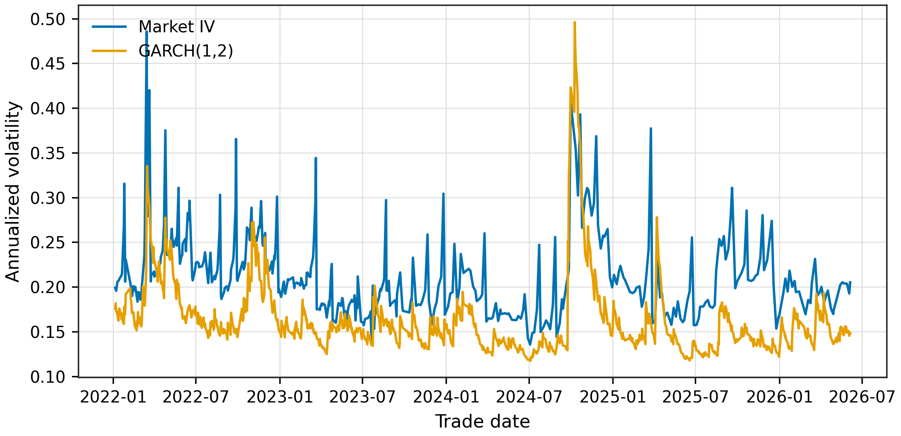
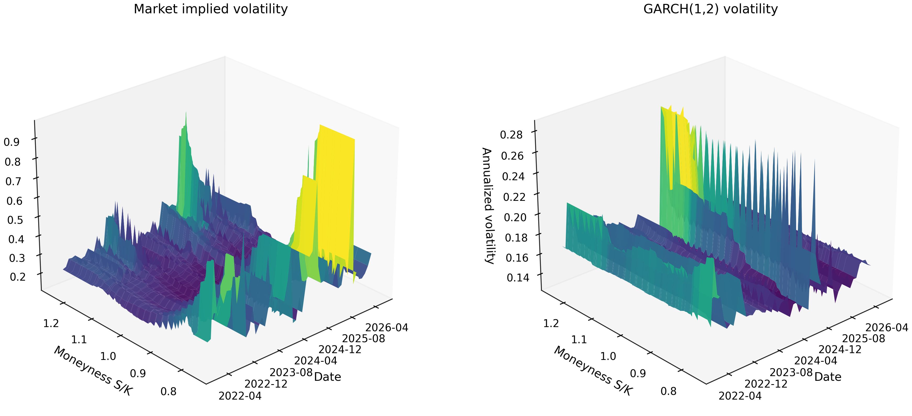
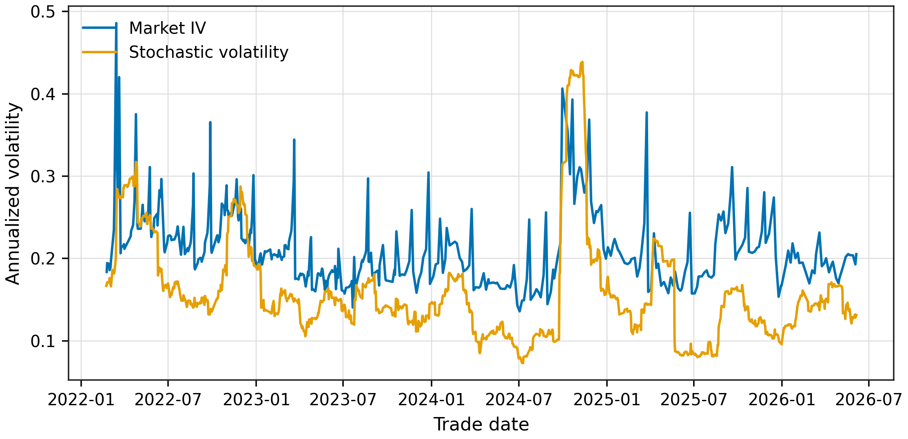
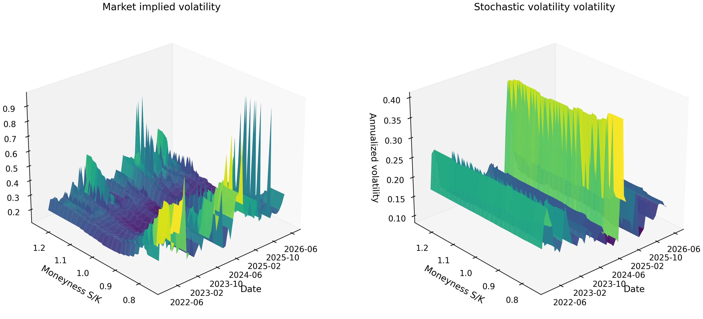
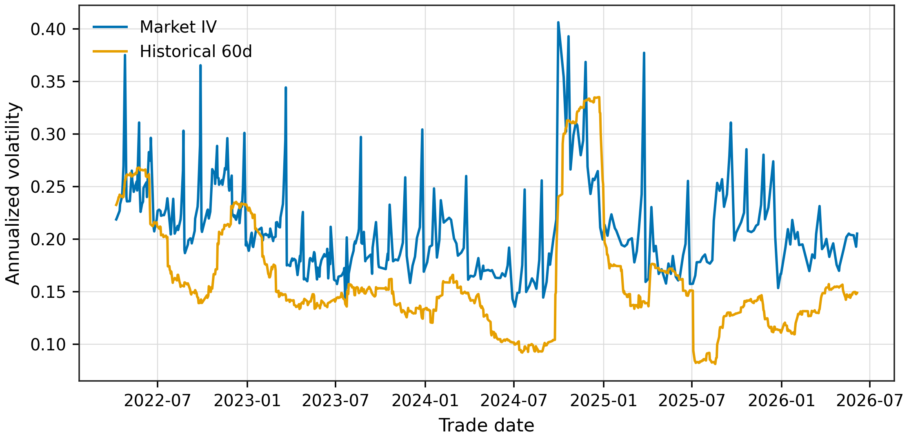
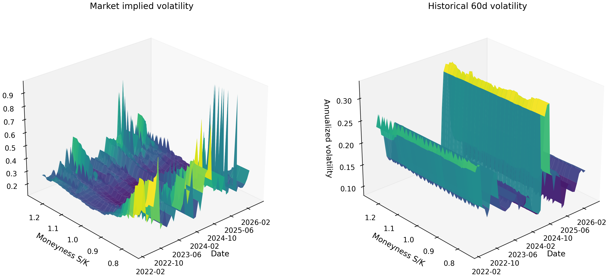

# 基于 BSM、GARCH 与随机波动率的上证 50ETF 期权定价实验报告

## 摘要

本文以 510050.SH 上证 50ETF 日行情作为唯一标的资产价格序列，对上证 50ETF 期权进行 BSM 定价实验。由于原始期权文件 `50ETF_option_full_with_rf.csv` 中不仅包含华夏上证 50ETF 期权，也混有其他 ETF 期权，为避免期权合约与标的资产不匹配，实验仅保留 `name` 字段包含 `华夏上证50ETF期权` 的样本。随后在统一的 Black-Scholes-Merton（BSM）定价框架下，比较历史波动率、GARCH 条件波动率和随机波动率近似三类波动率输入的定价效果。

过滤后最终可用于普通无股息 BSM 比较的期权日观测为 53193 条，其中可反解市场隐含波动率的样本为 51288 条。实验结果显示，GARCH 系列模型整体优于固定窗口历史波动率，其中 `GARCH(1,2)` 的 MAE 与 RMSE 均最低，分别为 0.011124 和 0.018035。

## 1. 文件夹架构

`bsm` 文件夹保存本实验的全部代码、数据副本、模型输出和图像。结构如下：

```text
bsm/
|-- README.md
|-- run_bsm_experiment.py
|-- sample_filter_summary.csv
|-- summary_metrics.csv
|-- market_implied_volatility.csv
|-- excluded_by_bsm_bounds.csv
|-- data/
|   |-- 50ETF_option_full_with_rf.csv
|   `-- 510050_daily.csv
|-- window_3d/
|-- window_5d/
|-- window_10d/
|-- window_30d/
|-- window_60d/
|-- model_garch/
|-- model_garch_1_2/
|-- model_garch_2_1/
|-- model_garch_2_2/
`-- model_stochastic_volatility/
```

其中 `window_*d/` 目录对应不同历史波动率窗口；`model_garch/` 对应 `GARCH(1,1)`；`model_garch_1_2/`、`model_garch_2_1/`、`model_garch_2_2/` 对应其他 GARCH 参数组合；`model_stochastic_volatility/` 对应随机波动率近似模型。各模型目录均包含：

```text
pricing_results.csv              逐条期权定价结果
error_metrics.csv                总体误差指标
error_by_call_put.csv            按看涨/看跌分组的误差
error_by_maturity.csv            按剩余期限分组的误差
error_by_moneyness.csv           按 moneyness 分组的误差
daily_error_metrics.csv          按交易日聚合的误差
volatility_estimates.csv         模型波动率序列
volatility_time_series.(png|pdf) 隐含波动率与模型波动率时间序列图
implied_vol_smile.(png|pdf)      最近交易日波动率微笑图
volatility_surface_3d.(png|pdf)  三维波动率曲面
market_vs_model_price.(png|pdf)  市场价格与模型价格散点图
mae_by_moneyness.(png|pdf)       按 moneyness 分组的 MAE 图
```

GARCH 和随机波动率目录额外包含 `model_parameters.csv`，记录模型参数估计结果。

## 2. 数据筛选与样本构造

原始数据来自：

- `bsm/data/50ETF_option_full_with_rf.csv`：期权合约日行情、行权价、剩余期限、无风险利率等字段。
- `bsm/data/510050_daily.csv`：510050.SH 上证 50ETF 日行情，用于计算标的资产对数收益率与波动率。

本实验必须保证期权合约和标的资产匹配。因此在读取期权文件后首先执行：

```text
name contains "华夏上证50ETF期权"
```

随后剔除市场价格、行权价、标的价格、剩余期限不可用的观测，并检查普通无股息 BSM 价格上下界。违反上下界的样本通常来自调整合约或缺少合约调整系数的记录，保存到 `excluded_by_bsm_bounds.csv`，不进入误差比较。

样本筛选过程如下：

| stage | rows | contracts |
|:--|--:|--:|
| raw_option_file | 106438 | 4486 |
| name_contains_huaxia_50etf_option | 57792 | 2088 |
| after_basic_price_maturity_filters | 57320 | 2074 |
| excluded_by_bsm_bounds | 4127 | 704 |
| final_pricing_sample | 53193 | 2060 |

这一步对结果影响很大。未过滤其他 ETF 期权时，期权价格与 510050.SH 标的价格不匹配，会人为放大定价误差；过滤后，模型价格与市场价格相关性显著提高，GARCH 模型相关系数达到约 0.994。

## 3. BSM 定价框架

BSM 模型假设标的资产价格服从几何布朗运动：

$$
\frac{dS_t}{S_t} = \mu dt + \sigma dW_t,
$$

在风险中性测度下，漂移项替换为无风险利率 \(r\)：

$$
\frac{dS_t}{S_t} = r dt + \sigma dW_t^Q.
$$

对无股息欧式看涨期权，有：

$$
C = S_0 N(d_1) - K e^{-rT} N(d_2),
$$

对无股息欧式看跌期权，有：

$$
P = K e^{-rT} N(-d_2) - S_0 N(-d_1),
$$

其中：

$$
d_1 =
\frac{\ln(S_0/K) + (r + \frac{1}{2}\sigma^2)T}
{\sigma\sqrt{T}},
\qquad
d_2 = d_1 - \sigma\sqrt{T}.
$$

本实验中：

- \(S_0\)：510050.SH 在交易日的收盘价；
- \(K\)：期权行权价；
- \(T\)：`days_to_maturity / 365`；
- \(r\)：期权数据中匹配到的 `rf_rate_decimal`；
- \(\sigma\)：不同模型给出的年化波动率。

因此，不同方法的核心差异不是定价公式，而是 \(\sigma\) 的估计方式。

## 4. 波动率估计方法

### 4.1 历史波动率

设 510050.SH 的日对数收益率为：

$$
r_t = \ln \frac{S_t}{S_{t-1}}.
$$

对长度为 \(L\) 的滚动窗口，样本均值和样本标准差为：

$$
\bar r_{t,L} = \frac{1}{L}\sum_{i=0}^{L-1} r_{t-i},
$$

$$
s_{t,L} =
\sqrt{
\frac{1}{L-1}
\sum_{i=0}^{L-1}
(r_{t-i}-\bar r_{t,L})^2
}.
$$

年化历史波动率定义为：

$$
\hat \sigma_{t,L}^{HV} = s_{t,L}\sqrt{252}.
$$

本文使用 3、5、10、30、60 个交易日窗口。短窗口能更快反映近期波动冲击，但估计噪声更大；长窗口更平滑，但在市场波动状态切换时可能滞后。

### 4.2 GARCH(p,q) 条件波动率

金融收益率常表现出波动聚集：大波动后更可能继续出现大波动，小波动后更可能继续出现小波动。GARCH 模型通过条件方差递推刻画这一特征。

设收益率方程为：

$$
r_t = \mu + \epsilon_t,
\qquad
\epsilon_t = z_t \sqrt{h_t},
\qquad
z_t \sim i.i.d.\ N(0,1).
$$

GARCH(p,q) 条件方差方程为：

$$
h_t =
\omega
+ \sum_{i=1}^{p}\alpha_i \epsilon_{t-i}^2
+ \sum_{j=1}^{q}\beta_j h_{t-j},
$$

其中：

- \(\omega > 0\)：长期方差水平相关的常数项；
- \(\alpha_i\)：过去冲击平方对当前方差的影响；
- \(\beta_j\)：过去条件方差对当前方差的延续影响；
- \(\sum_i \alpha_i + \sum_j \beta_j\)：波动持续性，越接近 1 表示波动冲击衰减越慢。

对一个剩余期限为 \(m\) 个交易日的期权，单日条件方差不足以描述整个持有期波动，因此实验使用多步条件方差预测：

$$
\widehat h_{t+1|t}, \widehat h_{t+2|t}, \ldots, \widehat h_{t+m|t}.
$$

期限匹配的平均日方差为：

$$
\bar h_{t,m}^{GARCH}
=
\frac{1}{m}
\sum_{k=1}^{m}
\widehat h_{t+k|t}.
$$

由于 `arch` 包中收益率以百分数形式估计，方差单位为百分数平方，转换为 BSM 年化波动率时使用：

$$
\hat\sigma_{t,m}^{GARCH}
=
\sqrt{
\frac{\bar h_{t,m}^{GARCH}}{10000}
\times 252
}.
$$

本实验比较四种参数组合：

| model | p | q | omega | alpha_sum | beta_sum | persistence | AIC | BIC |
|:--|--:|--:|--:|--:|--:|--:|--:|--:|
| GARCH(1,1) | 1 | 1 | 0.054077 | 0.064472 | 0.884818 | 0.949290 | 3034.424479 | 3054.318651 |
| GARCH(1,2) | 1 | 2 | 0.062154 | 0.074433 | 0.867263 | 0.941696 | 3036.024601 | 3060.892317 |
| GARCH(2,1) | 2 | 1 | 0.054077 | 0.064476 | 0.884816 | 0.949292 | 3036.424479 | 3061.292194 |
| GARCH(2,2) | 2 | 2 | 0.100408 | 0.116000 | 0.789272 | 0.905272 | 3037.626527 | 3067.467785 |

从参数看，四个 GARCH 模型的持续性都较高，说明 510050.SH 收益率波动具有明显持续性。其中 `GARCH(1,1)` 的 AIC/BIC 最低，参数最简洁；`GARCH(1,2)` 的定价误差略低，说明增加一个二阶 GARCH 滞后项在定价目标上有轻微收益，但统计信息准则并不支持更复杂模型有明显优势。

### 4.3 随机波动率模型

随机波动率模型放松 BSM 中常数波动率假设，将方差本身视为随机过程。经典 Heston 模型可写为：

$$
dS_t = rS_tdt + \sqrt{v_t}S_t dW_t^S,
$$

$$
dv_t = \kappa(\theta - v_t)dt + \xi\sqrt{v_t}dW_t^v,
$$

其中：

- \(v_t\)：瞬时方差；
- \(\theta\)：长期方差均值；
- \(\kappa\)：均值回复速度；
- \(\xi\)：方差波动率；
- \(dW_t^S\) 与 \(dW_t^v\) 可相关，用于解释隐含波动率偏斜。

本实验没有完整实现 Heston 特征函数定价，而是构造一个 Heston 风格的离散均值回复方差近似。首先使用 30 日滚动实现方差：

$$
RV_t = \frac{1}{29}\sum_{i=0}^{29}(r_{t-i}-\bar r_{t,30})^2.
$$

然后估计离散均值回复形式：

$$
RV_{t+1} = a + \phi RV_t + u_{t+1}.
$$

长期方差均值近似为：

$$
\theta = \frac{a}{1-\phi}.
$$

给定期权剩余期限 \(m\)，未来平均方差的条件期望为：

$$
\bar v_{t,m}
=
\theta
+
\frac{\phi(1-\phi^m)}{m(1-\phi)}
(RV_t-\theta).
$$

最终代入 BSM 的等效年化波动率为：

$$
\hat\sigma_{t,m}^{SV}
=
\sqrt{252\bar v_{t,m}}.
$$

本实验估计得到：

| model | realized_variance_window | daily_theta | daily_phi | annualized_long_run_vol | variance_innovation_std |
|:--|--:|--:|--:|--:|--:|
| Heston-style stochastic volatility | 30 | 0.000116 | 0.990535 | 0.171049 | 0.0000165 |

其中 \(\phi=0.990535\)，说明实现方差具有很强持续性；长期年化波动率约为 17.10%。该模型的定价表现优于多数历史波动率窗口，但弱于 GARCH 模型，说明仅用实现方差均值回复还不足以完全捕捉期权市场隐含的风险溢价和波动率曲面结构。

## 5. 误差指标

设模型价格为 \(\hat P_i\)，市场价格为 \(P_i\)，误差为：

$$
e_i = \hat P_i - P_i.
$$

本文使用以下指标：

$$
MAE = \frac{1}{n}\sum_{i=1}^{n}|e_i|,
$$

$$
RMSE = \sqrt{\frac{1}{n}\sum_{i=1}^{n}e_i^2},
$$

$$
MAPE = \frac{1}{n}\sum_{i=1}^{n}\left|\frac{e_i}{P_i}\right|,
$$

$$
SMAPE =
\frac{1}{n}\sum_{i=1}^{n}
\frac{2|e_i|}{|\hat P_i|+|P_i|}.
$$

由于期权价格可能接近 0，普通 MAPE 容易被极低权利金样本放大，因此同时报告 `SMAPE` 和设置 0.01 价格分母下限后的 `mape_price_floor_0_01`。

## 6. 实验结果

### 6.1 总体结果

| model | n | mean_error | mae | rmse | median_abs_error | mape | smape | mape_price_floor_0_01 | bias_ratio | correlation_market_model |
|:--|--:|--:|--:|--:|--:|--:|--:|--:|--:|--:|
| garch_1_2 | 53049 | -0.008643 | 0.011124 | 0.018035 | 0.005925 | 0.261256 | 0.388944 | 0.158794 | -0.217884 | 0.994107 |
| garch_2_1 | 53049 | -0.008641 | 0.011128 | 0.018042 | 0.005930 | 0.261374 | 0.389101 | 0.158888 | -0.217828 | 0.994100 |
| garch_1_1 | 53049 | -0.008642 | 0.011129 | 0.018043 | 0.005930 | 0.261382 | 0.389114 | 0.158895 | -0.217842 | 0.994100 |
| garch_2_2 | 53049 | -0.008788 | 0.011224 | 0.018167 | 0.005986 | 0.262863 | 0.391682 | 0.160196 | -0.220246 | 0.994053 |
| stochastic_volatility | 50769 | -0.006325 | 0.012058 | 0.018779 | 0.007304 | 0.299186 | 0.424988 | 0.189013 | -0.190421 | 0.992406 |
| historical_60d | 48344 | -0.005271 | 0.013526 | 0.021724 | 0.007530 | 0.317087 | 0.439498 | 0.204767 | -0.172709 | 0.988556 |
| historical_30d | 50769 | -0.006646 | 0.015335 | 0.024421 | 0.008837 | 0.351747 | 0.489131 | 0.236930 | -0.195693 | 0.986523 |
| historical_10d | 52378 | -0.008024 | 0.018758 | 0.031637 | 0.009998 | 0.424947 | 0.562542 | 0.295287 | -0.193498 | 0.977485 |
| historical_5d | 52639 | -0.009526 | 0.022780 | 0.038950 | 0.012296 | 0.492972 | 0.652007 | 0.352455 | -0.200482 | 0.966302 |
| historical_3d | 52911 | -0.012710 | 0.026422 | 0.044047 | 0.014854 | 0.558799 | 0.753568 | 0.407016 | -0.232741 | 0.958304 |

### 6.2 历史波动率窗口分析

历史波动率模型呈现明显的窗口效应。3 日窗口 MAE 为 0.026422，60 日窗口 MAE 降至 0.013526，说明短窗口波动率估计噪声较强，容易受极端收益影响。随着窗口增长，波动率输入更稳定，BSM 价格也更接近市场价格。

但 60 日窗口仍弱于 GARCH 和随机波动率模型。这说明单纯使用固定历史窗口难以同时处理波动聚集、期限结构和隐含波动率微笑。历史窗口越长，越容易获得平滑估计；但它仍是后视估计，并不直接建模未来条件方差。

### 6.3 GARCH 模型分析

四个 GARCH 模型结果非常接近，MAE 均约为 0.0111，RMSE 均约为 0.0180，明显优于历史波动率与随机波动率近似模型。其中 `GARCH(1,2)` 以极小优势取得最低 MAE 和 RMSE。

不过，从参数估计看，`GARCH(1,1)` 的 AIC/BIC 最低，而 `GARCH(1,2)` 的 AIC/BIC 更高。这说明 `GARCH(1,2)` 在当前期权定价误差目标下略优，但并不代表它在统计拟合意义上显著优于 `GARCH(1,1)`。如果考虑模型简洁性与稳健性，`GARCH(1,1)` 仍是很有竞争力的基准模型。

GARCH 模型的优势来自两个方面。第一，它使用条件方差递推，能够捕捉波动聚集；第二，实验不是简单取下一日方差，而是对期权剩余期限内的多步预测方差取平均，因此不同期限期权使用了期限匹配的波动率输入。

### 6.4 随机波动率模型分析

随机波动率近似模型 MAE 为 0.012058，低于所有历史波动率窗口，但高于 GARCH 模型。该结果说明，实现方差均值回复能够提供比固定窗口更合理的动态波动率输入；不过本实验采用的是 BSM 等效波动率近似，而不是完整 Heston 期权定价公式，因此尚未利用随机波动率模型在解释偏斜、峰度和价格-波动率相关性方面的全部能力。

该模型估计得到的 \(\phi=0.990535\) 表明实现方差高度持续，长期年化波动率约 17.10%。这与 ETF 市场低到中等波动水平相符，但市场隐含波动率中包含风险溢价和投资者预期，仅靠历史实现方差均值回复仍会低估部分期权价格。

### 6.5 系统性偏差

所有模型的 `mean_error` 和 `bias_ratio` 均为负，说明模型价格平均低于市场价格。GARCH(1,2) 的 `bias_ratio` 为 -0.217884，随机波动率模型为 -0.190421，历史 60 日窗口为 -0.172709。也就是说，即便 GARCH 模型 MAE 最低，它仍存在一定系统性低估。

这种低估可能来自：BSM 无股息与常波动率假设过于简化；市场期权价格包含波动率风险溢价、流动性溢价和跳跃风险补偿；同时本实验未显式建模分红、交易成本、买卖价差和完整合约调整因子。

## 7. 图像结果

### 7.1 GARCH(1,2)





### 7.2 随机波动率模型





### 7.3 历史波动率 60 日窗口





## 8. 主要结论

1. 合约名称过滤是必要的。原始期权文件包含多个 ETF 期权样本，若不筛选 `华夏上证50ETF期权`，会导致期权合约与 510050.SH 标的资产不匹配，显著污染 BSM 定价误差。

2. GARCH 类模型整体表现最好。`GARCH(1,2)` 的 MAE 为 0.011124、RMSE 为 0.018035，是当前实验中误差最低的模型；`GARCH(1,1)` 与其非常接近，并且 AIC/BIC 更优，说明简洁 GARCH 模型已经能捕捉主要波动结构。

3. 随机波动率近似优于固定窗口历史波动率，但弱于 GARCH。其优势在于引入方差均值回复，缺点是当前实验仍采用 BSM 等效波动率，没有完整实现 Heston 定价。

4. 历史波动率窗口越长，表现越好。60 日窗口显著优于 3、5、10、30 日窗口，说明短窗口估计噪声较强，容易造成 BSM 价格不稳定。

5. 所有模型平均都低估市场价格。这提示市场期权价格中可能包含波动率风险溢价、跳跃风险、流动性因素和制度性交易摩擦，单纯 BSM 等效波动率方法仍有结构性局限。

## 9. 复现实验

运行脚本会重新生成 CSV 指标与图像，但不会再自动覆盖本 Markdown 报告：

```bash
python bsm/run_bsm_experiment.py
```
